# RabbitMQ-To-REST-API-Forwarder

A event-forwarding helper service for the Windows Sound Scanner; see [WinSoundScanner](https://github.com/collect-sound-devices/win-sound-scanner-go).

## Motivation

RabbitMQ-To-REST-API-Forwarder's purpose is to fetch HTTP request messages from RabbitMQ and forward
them to a configured REST API endpoint.

## Event Forwarding Pattern

RabbitMQ-To-REST-API-Forwarder implements a message forwarding pattern that includes debouncing
for frequent volume change events and reliable delivery with retry and failed queues.

```mermaid
flowchart TD
    A[["Windows Sound Scanner<br>(WinSoundScanner)"]] ==>|"enqueue HTTP messages"| B["RabbitMQ"]
    B ==>|"consume"| C["RabbitMqConsumerService<br>(BackgroundService)"]
    C ==>|"debounce (volume events)"| D["DebounceWorker"]
    C ==>|"direct forward<br>(other events)"| E["SendToApiAsync"]
    D ==>|"winner message"| E
    E ==>|"POST / PUT"| F[["REST API Endpoint"]]
    E -->|"on failure"| G["Retry Queue<br>(.retry)"]
    G -->|"TTL expires → re-deliver"| B
    E -->|"max retries exceeded"| H["Failed Queue<br>(.failed)"]
```



## Functions

- (Background) The Windows Sound Scanner transforms its sound events into HTTP request
  messages and enquies them into a local RabbitMQ message broker
- RabbitMQ-To-REST-API-Forwarder runs as a Docker container on the Sound Windows Agent host machine
- It reads from a local RabbitMQ queue and POSTs/PUTs to the configured API base URL
- It applies debouncing of frequent volume-change PUT-requests.
  * The respective time window is configurable via `RabbitMqMessageDeliverySettings:VolumeChangeEventDebouncingWindowInMilliseconds`.
- It guarantees reliable delivery with delayed retries
  * It uses retry and failed queues (the message is routed to a failed queue after the retry max is reached),
  see settings: `RabbitMqMessageDeliverySettings:RetryDelayInSeconds`, `MaxRetryAttempts`.


## Technologies Used

- RabbitMQ-To-REST-API-Forwarder:
  - **.NET 8 Generic Host Template** builds Windows Console App or Windows Service.
  - **RabbitMQ.Client** library for interacting with RabbitMQ.
  - **NLog** logging library for .NET.
  - Distributed as a Docker container, see `docker-compose.yml`. The respactive images are built via GitHub Actions CI/CD pipeline
    and regularary published to GitHub Container Registry.
- RabbitMQ:
  - Distributed as a Docker container, see an Official RabbitMQ Docker image and `docker-compose.yml`.

## Usage

1. Install Docker Desktop on the Sound Windows Agent Windows machine
2. Download and unzip the latest rollout of RabbitMQ-To-REST-API-Forwarder: RmqToRestApiForwarder-x.x.x from the latest repository release assets: [Release](https://github.com/eduarddanziger/rmq-to-rest-api-forwarder/releases/latest)
3. Create a `logs` folder in the unzipped folder
4. Use docker-compose to bring the RabbitMQ and rmq-to-rest-api-forwarder containers up on the host machine:
   Open a PowerShell prompt in the unzipped folder and run:
  ```powershell
  docker-compose up -d
  ```

## Developer Environment: How to Build and Run (Windows)

1. Install Visual Studio 2022 or the .NET 8 SDK
2. Restore packages and build the solution:

```powershell
# Using dotnet CLI
dotnet build RmqToRestApiForwarder.sln -c Release
```

3. (Optional) Publish a self-contained single-file for Windows x64:

```powershell
# Publish with the included publish profile
dotnet publish "Projects/RmqToRestApiForwarder/RmqToRestApiForwarder.csproj" -c Release -p:PublishProfile=WinX64
```

4. Developer Manual

For deeper developer explanations (Podman vs Docker), see: https://github.com/eduarddanziger/rmq-to-rest-api-forwarder/blob/HEAD/PODMAN-vs-DOCKER.md

## Changelog

- 2025-12-21: Readme improvements and clarifications.
- 2025-12-18: Switched MSBuild inline tasks to RoslynCodeTaskFactory for cross-platform builds (Windows/Linux).
- 2025-12-18: Replaced legacy tasks with inline regex and zip implementations; fixed warnings and improved Docker publish flow.

## License

This project is licensed under the terms of the [MIT License](LICENSE).

## Contact

Eduard Danziger

Email: [edanziger@gmx.de](mailto:edanziger@gmx.de)
